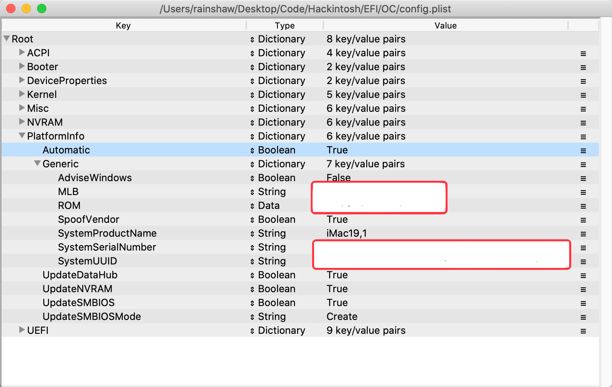

# i7 8700K - ROG Maximus X Hero Z370 - Vega 56 Hackintosh 

## 使用帮助

点击Clone or Download，将EFI文件夹复制到您的EFI分区，建议修改config.plist中的三码后再使用。您可以使用Clover Configurator方便的生成属于您的三码。

## 硬件

| CPU        | Intel Core i7 8700k @3.4GHz                    |
| ---------- | ---------------------------------------------- |
| 主板       | 华硕 ROG Maximus X Hero Z370 芯片组            |
| 内存       |                                                |
| 显卡       | 蓝宝石 Radeon RX Vega 56 8G HBM2 白金版        |
| 蓝牙Wi-Fi  | BCM 943602CS 黑苹果免驱                        |
| SSD1       | 海康威视 C2000Pro 2T For Macintosh             |
| SSD2       | 三星 950Pro 512GB For Win10                    |
| SSD3       | 东芝 Q200 256GB For Ubuntu                     |
| SSD4       | 金士顿 128G Format as exfat For 系统间文件共享 |
| HDD        | 西部数据 蓝盘 2TB For Backup                   |
| 电源       | 台达NX550铜牌非模组                            |
| CPU Cooler | 酷冷至尊120水冷                                |
| 机箱       | INWIN 迎广 303                                 |
| 显示器     | LG 27UL600 4K IPS HDR400                       |

## Bios 设置

首先恢复默认设置，然后依次设置

- Disable Fast Boot (Boot > Boot Configuration > Fast Boot)
- Disable Vt-d(Advanced > System Agent (SA) Configruation > VT-d)
- Disable CSM(Boot > CSM (Compatibility Support Module) > Launch CSM)
- Disable Intel SGX(Advanced > CPU Configuration > SW Guard Extensions (SGX))
- Disable CFG Lock(Advanced > CPU Configuration > CPU - Power Management Control > CFG Lock)

- Enable VT-x(Advanced > CPU Configuration > Intel Virtualization Technology)
- Enable Above 4G Decoding (Advanced > System Agent (SA) Configuration > Above 4G Decoding)
- Enable Hyper Threading(Advanced > CPU Configuration > Hyper-Threading)
- Enable Execute Disable Bit(Advanced > CPU Configuration > Execute Disable Bit)
- Set OS type: Other OS(Boot > Secure Boot > OS Type)
- Set Extreme Tweaker > Ai Overclock Tuner -> XMP (Select no to 'enhance the system preformance')
- Enabled iGPU Multi-Monitor  (Advanced > System Agent (SA) Configuration > Graphics Configuration > iGPU Multi-Monitor)
- Set Primary Display to PEG (Advanced > System Agent (SA) Configuration > Graphics Configuration > Primary Display)
- Set DVMT Pre-Allocated to 64M (Advanced > System Agent (SA) Configuration > Graphics Configuration > DVMT Pre-Allocated) (需要先保存上面的设置后再进入BIOS才能看到这条设置，我只有设置了这三项之后随航Sidecar才可以正常使用)
- 检查Fan设置, AIO pump 应当设置为始终 100%，因为这是水冷泵。水冷的风扇可以直接插到主板上的CPU Header 和 CPU Opt Header 插口

## Opencore 配置

| 软件包        | 版本  | 更新日期   |
| ------------- | ----- | ---------- |
| Opencore      | 0.6.0 | 2020-08-03 |
|               |       |            |
| VirtualSMC    | 1.1.5 | 2020-08-03 |
| LiLu          | 1.4.6 | 2020-08-03 |
| WhateverGreen | 1.4.1 | 2020-08-03 |
| AppleALC      | 1.5.1 | 2020-08-03 |
| IntelMausi    | 1.0.3 | 2020-06-01 |
| NVMeFix       | 1.0.3 | 2020-08-03 |

## SSDT补丁

### DSDT.aml

提取自Clover F4，建议大家自行提取，方法很多种

### SSDT-EC-USBX.aml

按照https://dortania.github.io/Getting-Started-With-ACPI/Universal/ec-methods/manual.html的步骤，使用https://github.com/acidanthera/OpenCorePkg/blob/master/Docs/AcpiSamples/SSDT-EC-USBX.dsl进行生成。

1. 首先使用maciASL打开自己的DSDT.aml，搜索`PNP0C09`，找到两个

   

   

   由于第一个`H_EC`的`_HID`、`_CRS`、`_GPE`属性不全，所以第二个`EC0`才是我们要处理的

2. 按照教程，打开`SSDT-EC-USBX.dsl`进行修改得到`SSDT-EC-USBX.aml`，拷贝到OC/ACPI目录下并在config中加载它

### SSDT-PLUG.aml

按照https://dortania.github.io/Getting-Started-With-ACPI/Universal/plug-methods/manual.html的步骤，使用https://github.com/acidanthera/OpenCorePkg/blob/master/Docs/AcpiSamples/SSDT-PLUG.dsl进行生成。

1. 首先使用maciASL打开自己的DSDT.aml，搜索`Processor`
   
   所以我们的路径为`_PR.PR00`
2. 打开`SSDT-PLUG.dsl，按照教程修改得到`SSDT-PLUG.aml`，拷贝到OC/ACPI目录下并在config中加载它

## USB定制

由于我的机箱只有一对USB2.0和一对USB3.0，所以我将机箱的USB2.0延长线插到下图USB910处，而USB1112接口用来连接Wi-Fi蓝牙卡的USB连线。

| 类型 | 接口编号 | 接口名称            | 类型     | 定制 | 说明                                                         |
| ---- | -------- | ------------------- | -------- | ---- | ------------------------------------------------------------ |
| XHC  | 1        | SS01/HS01           | USB3     | SS01 | 只支持USB3                                                   |
| XHC  | 2        | SS02/HS02           | USB3     | SS02 | 只支持USB3                                                   |
| XHC  | 3        | SS03/HS03           | USB3     | SS03 | 只支持USB3                                                   |
| XHC  | 4        | SS04/HS04           | USB3     | SS04 | 只支持USB3                                                   |
| XHC  | 5        | SS05/HS05           | USB3     | SS05 | 只支持USB3                                                   |
| XHC  | 6        | SS06/HS06           | USB3     | SS06 | 只支持USB3                                                   |
| XHC  | 7        | HS07                | Internal | HS07 | 只支持USB2且内建                                             |
| XHC  | 8        | HS08                | Internal | HS08 | 只支持USB2且内建                                             |
| XHC  | 9        | HS09                | Internal | HS09 | 只支持USB2且内建                                             |
| XHC  | 10       | HS10                | Internal | HS10 | 只支持USB2且内建                                             |
| XHC  |          | HS11                | USB2     | 弃用 | 无法使用的端口                                               |
| XHC  |          | HS12                | Internal | HS12 | 蓝牙内建                                                     |
| XHC  |          | HS13                | USB2     | 弃用 | 无法使用的端口                                               |
| XHC  |          | HS14                | Internal | HS14 | AURA LED Controller内建                                      |
| XHC  |          | USR1/USR2           |          | 弃用 | Mac不支持，详见[说明](https://dortania.github.io/OpenCore-Post-Install/usb/manual/manual.html) |
| XHC  |          | SS07/SS08/SS09/SS10 |          | 弃用 | 猜测为主板上的USB3.1Gen2端口，没用到所以弃用                 |
| PXSX | 12       | PRT1                | TypeC+SW | PRT1 | 后置USB3.1Gen2 TypeC端口                                     |
| PXSX | 11       | PRT2                | USB3     | PRT2 | 后置USB3.1Gen2 TypeA端口                                     |
| PXSX | 12       | PRT3                | TypeC+SW | PRT3 | 后置USB3.1Gen2 TypeC端口                                     |
| PXSX | 11       | PRT4                | USB3     | PRT4 | 后置USB3.1Gen2 TypeA端口的USB2模式                           |

上表对应于EFI中的USBPort.kext文件，您可自行修改以满足您的个人需求。

值得一提的是7、8、9、10端口只支持USB2.0所以我将他们全部内建，这样可以将无线键鼠的接收器插到上面，当然还可以插入打印机、音响耳机等，依次解决电脑的睡眠即醒情况。

## ChangeLog

### 2020-08-11

1. 更新kexts

### 2020-06-06

1. 升级版本，增加USB端口定制